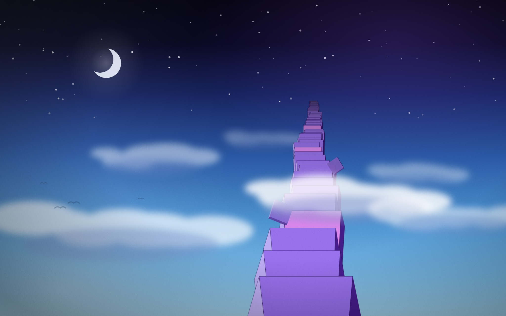
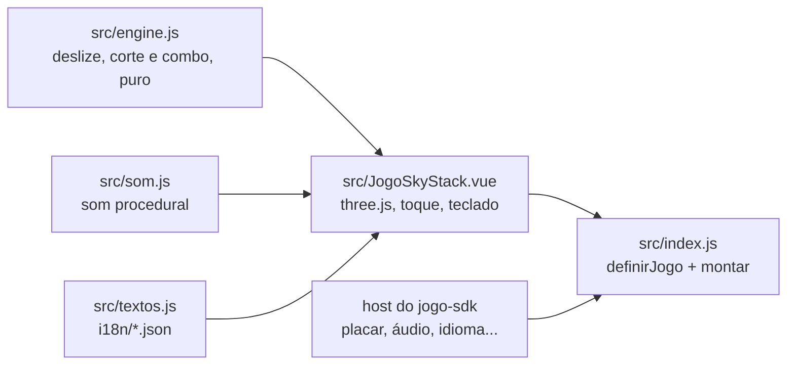

# SkyStack

O SkyStack do [RoqueOS](https://roqueos.com.br): empilhe blocos 3D até o espaço. O bloco
desliza sobre a torre e um toque solta; o pedaço que passa do bloco de baixo cai fora, e a
próxima base é só o que sobrou. Acertar em cheio devolve um pouco da largura. Jogue em
[roqueos.com.br/jogar/skystack](https://roqueos.com.br/jogar/skystack).

_English below._

## Por que existe

Até 25/09/2026 este jogo morava dentro do repositório do RoqueOS e importava as stores do
sistema direto. Agora ele é um repo próprio na organização
[roqueos-games](https://github.com/roqueos-games), aberto, e fala com o RoqueOS só pelo
[`jogo-sdk`](https://github.com/roqueos-games/jogo-sdk). O mesmo código roda no RoqueOS,
sozinho no seu navegador (`yarn dev`) e no teste.

## Arquitetura

- `src/engine.js` é a regra do jogo, sem three.js, sem Vue e sem DOM: o deslize de ida e
  volta, a geometria do corte (a sobra e o pedaço que cai), a tolerância do encaixe perfeito,
  o combo que devolve largura, a velocidade que sobe com a altura, os pontos, as cores dos
  blocos e os cenários por altura.
- `src/JogoSkyStack.vue` desenha a torre com three.js (câmera ortográfica, luz com sombra, os
  cacos que caem, o anel do perfeito) e ouve toque, clique e teclado. Tudo o que vem do sistema
  (recorde e partidas da conta, áudio, perfil de aparelho fraco, métrica, aviso, idioma) chega
  pelo `host`.
- `src/som.js` é o som, feito de osciladores, sem arquivo de áudio.
- `src/index.js` cria um app Vue próprio dentro do elemento que o host entrega e devolve
  `{ ativar, desmontar }`.
- `jogo.json` é o manifesto: nome e descrição nos dez idiomas, SEO, etiquetas, capa, ícone,
  tamanho de janela e a chave do recorde. O RoqueOS confere que ele bate com o catálogo.

O `three` não vem junto: ele é `peerDependency`, e o RoqueOS fornece o dele. A versão em
`devDependencies` é a mesma instalada no RoqueOS, só para o teste e o `yarn dev`.

## Pré-requisitos

- Node 24 (o `.nvmrc` diz), ou 22 no mínimo.
- Yarn 1.22.

## Como rodar

1. `yarn install --ignore-scripts`
2. `yarn dev` e abra o endereço que o Vite mostrar: o jogo roda com o host de
   desenvolvimento do SDK, com o recorde no `localStorage`. Precisa de WebGL.
3. `yarn verificar` antes de abrir PR: lint, formato, testes e o `jogo check`, o mesmo que o
   CI roda.

## Estrutura

| Caminho              | O que é                                                               |
| -------------------- | --------------------------------------------------------------------- |
| `src/`               | o jogo (engine, tela, som, ícones, textos, entrada)                   |
| `i18n/`              | um JSON por idioma, com as mesmas chaves nos dez                      |
| `public/`            | capa e ícone; a origem de cada arquivo está no [ASSETS.md](ASSETS.md) |
| `test/`              | testes com o host falso do SDK, sem nada do RoqueOS                   |
| `dev/`, `index.html` | o jogo sozinho no navegador, para desenvolver                         |
| `jogo.json`          | o manifesto que o RoqueOS lê                                          |

## Onde ele se encaixa

O RoqueOS instala este repo por uma tag exata e monta o jogo pelo `mount` do SDK, na janela,
em `/jogar/skystack` e no modo TV. Uma mudança aqui só chega ao RoqueOS quando uma tag nova é
pinada lá, depois de revisada. As chaves de armazenamento (`best`, `games`, `muted`, `seen`)
e os nomes de evento (`game_start`, `game_over`) não mudam: o recorde de quem já joga e o
histórico de uso dependem deles. O placar da conta recebe `{ best, games }`, os dois números,
com os mesmos nomes de antes; em qual documento isso fica é decisão do host do RoqueOS.

Mudança no que toca a GPU (renderer, pixel ratio, sombras, luzes, materiais, o corte do modo
leve) só entra com teste no iPhone de verdade: verde no desktop não é verde no iPhone.

## Licença

MIT, no código e na arte própria. Veja [LICENSE](LICENSE) e [ASSETS.md](ASSETS.md).

---

## English

SkyStack from [RoqueOS](https://roqueos.com.br): stack 3D blocks all the way to space. Whatever
overhangs the block below falls away, and a perfect drop gives back a little width. It talks
to RoqueOS only through the [`jogo-sdk`](https://github.com/roqueos-games/jogo-sdk), so the
same code runs inside RoqueOS, standalone in your browser and in tests.

- `yarn install --ignore-scripts`, then `yarn dev` to play it locally (WebGL required).
- `yarn verificar` runs lint, formatting, tests and `jogo check`, exactly like CI.
- `three` is a peer dependency: RoqueOS provides it, and the version is pinned to RoqueOS's.
- Code and comments are in Brazilian Portuguese; issues and pull requests in English are
  welcome.
- Storage keys (`best`, `games`, `muted`, `seen`) and event names (`game_start`,
  `game_over`) are stable on purpose: existing players' records and analytics depend on them.
- Anything that touches the GPU (renderer options, pixel ratio, shadows, lights, materials,
  the low-end cut) only changes with testing on a real iPhone.

MIT licensed, code and original art.
